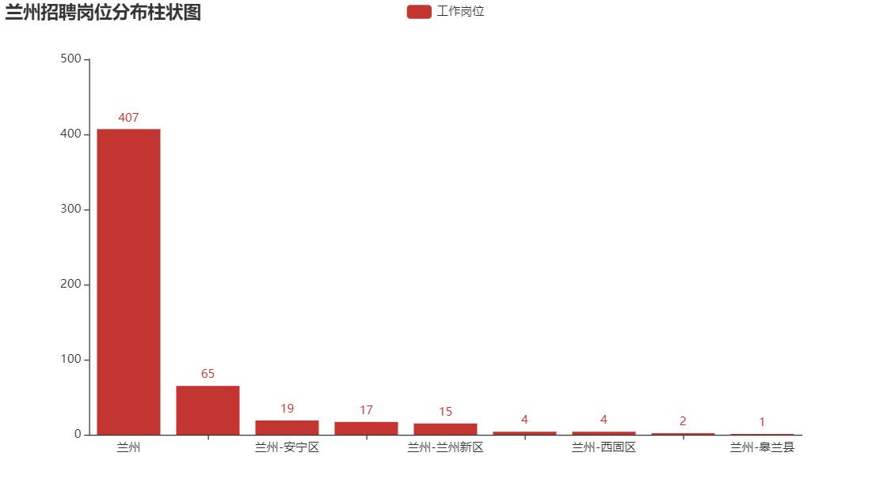
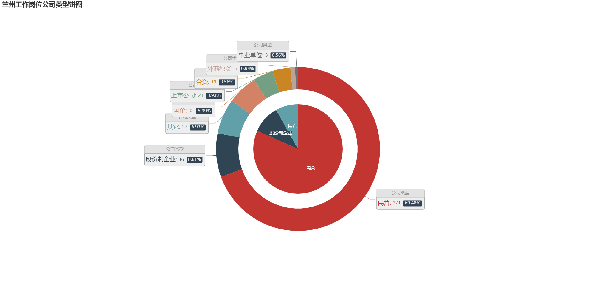
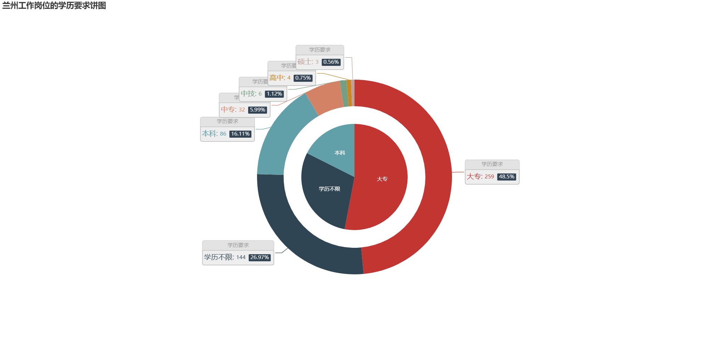
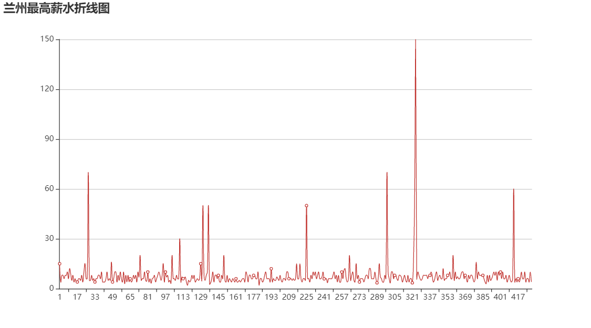
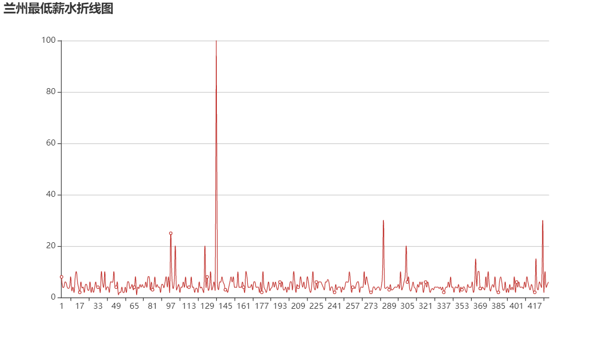
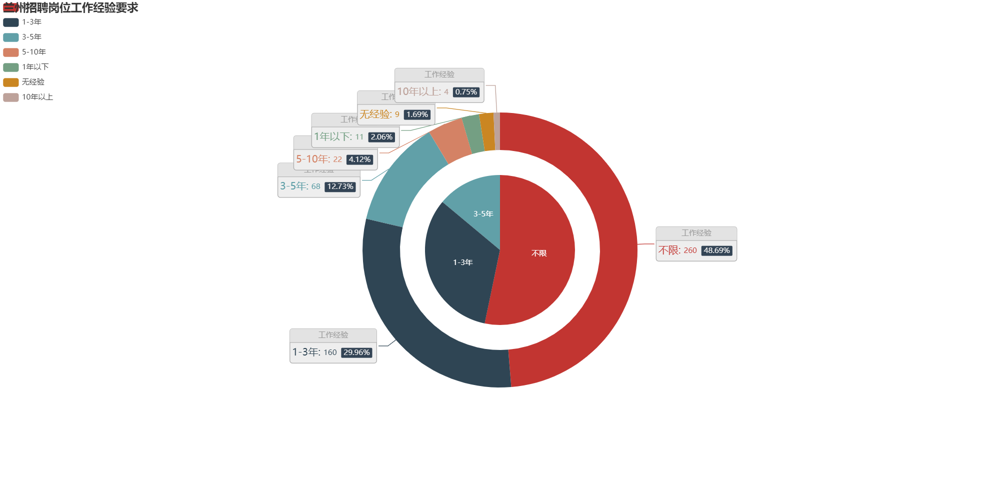

# 兰州招聘岗位的分析

[Python库依赖](../../network/dependencies)

这是我在由王忠老师主讲的兰州大学计算机网络课程上作出的课程设计。

我选取了[智联招聘](https://www.zhaopin.com/)作为数据来源，获取到了data文件夹下的json文件，随后将爬取的信息存入data文件夹下的[jobData.db](./data/jobData.db) sqlite数据库中，然后进行数据清洗，使用pyecharts库作图，生成了view文件夹下的html文件。详情请参见[Analysis-of-Recruitment-Posts-for-Lanzhou.pdf](Analysis-of-Recruitment-Posts-for-Lanzhou.pdf)

请使用pyecharts库V1或更高版本，[指南](https://pyecharts.org)

请首先运行[爬虫脚本](Spider.py)爬取数据，然后选择附录中要生成的图的类型，运行相应的脚本。

***使用前请确保电脑上已经安装了Sqlite3并且已经将Sqlite3添加到了系统Path变量中.***

# Analysis of Recruitment Posts for Lanzhou

[Python Dependencies](../../network/dependencies)

This is the course design I made in the Computer Network course, which was taught by our teacher Wang Zhong(王忠).

I selected [Zhaopin Recruitment](https://www.zhaopin.com/) as the data source, after obtaining the JSON file under the data folder, then I store the crawled information into the data folder's [jobData.db](./data/jobData.db) SQLite database, then wash the data, use the pyecharts library to draw chats, and generated the HTML file under the view folder. See [Analysis-of-Recruitment-Posts-for-Lanzhou.pdf](Analysis-of-Recruitment-Posts-for-Lanzhou.pdf) for details.

Please use pyecharts V1+，[Guides](https://pyecharts.org)

First run [Spider](Spider.py) to crawl data, then select the type of graph to be generated in the appendix and run the script accordingly.

***Please make sure that the computer has already installed Sqlite3 and Sqlite3 has been added to the system Path variable before use.***

## 附录 Appendix

* [ShowAddress](ShowAddress.py)
  
  

* [ShowCompanySizeFunnel](ShowCompanySizeFunnel.py)
  
  

* [ShowCompanyTypelPie](ShowCompanyTypelPie.py)
  
  

* [ShowEduLevelPie](ShowEduLevelPie.py)
  
  

* [ShowJobNameCloudChart](ShowJobNameCloudChart.py)
  
  

* [ShowMaxSalary](ShowMaxSalary.py)
  
  

* [ShowMinSalary](ShowMinSalary.py)
  
  

* [ShowWorkingExplPie](ShowWorkingExplPie.py)
  
  
